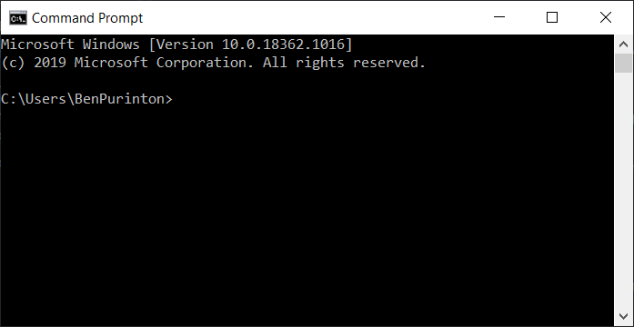
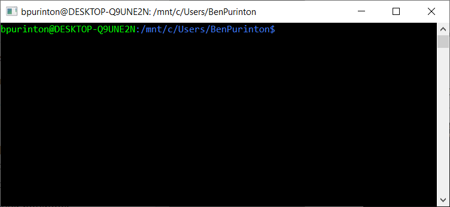
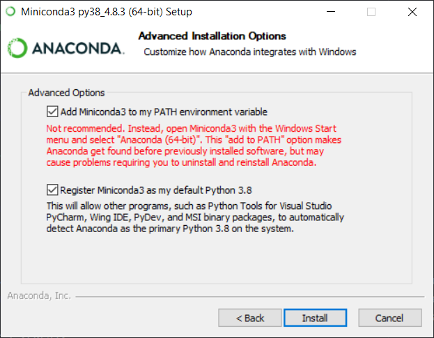
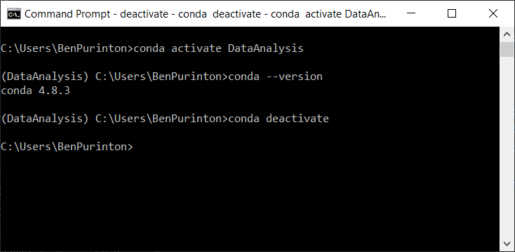
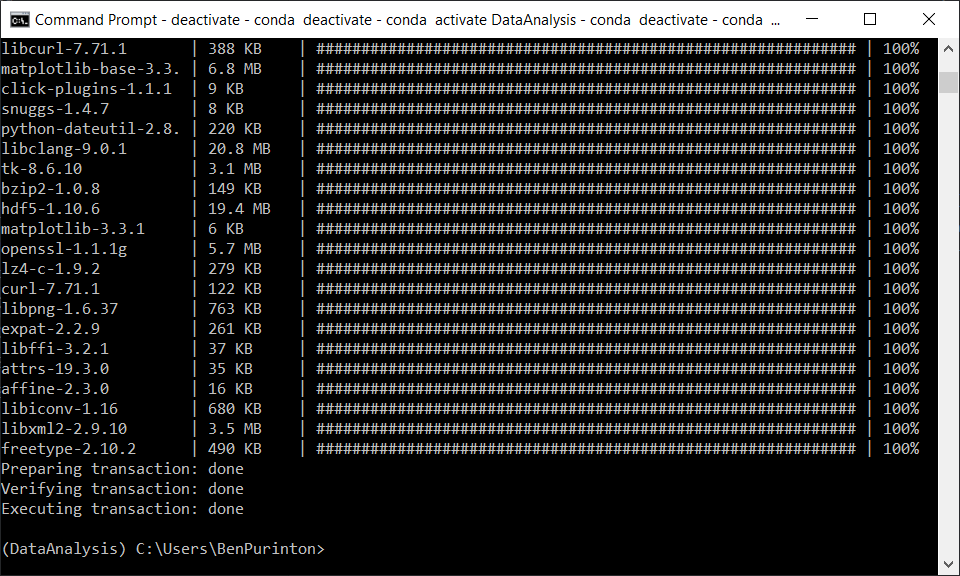

# Contact

If you have questions about this document you can find our team webpage with contact info at [https://up-rs-esp.uni-potsdam.de/](https://up-rs-esp.github.io/). Most questions can be addressed to Dr. Harald Schernthanner ([hschernt@uni-potsdam.de](mailto:hschernt@uni-potsdam.de)).

# Objectives

This document describes in detail the installation of a Python environment for courses in the Remote Sensing Master's. The document focuses on the course _Data Analysis and Statistics_, but is applicable to our other Python-based courses. We suggest using Ubuntu or some other Linux-based distribution (Mac is Linux-based) as these are the most flexible operating systems, but Windows OS will work as well. We also discuss the Jupyter Notebook environment that we use for lectures and homework.

A separate document titled _Geological Remote Sensing SSH Setup_ walks through how to access and work remotely using the PC Pool at Potsdam with `ssh` logins, and another document titled _Geological Remote Sensing Additional Software_ contains some additional software to install (e.g., QGIS).


# Python Installation

## Why We Choose Python

The main reasons that we choose Python in our classes are: (1) it's open source requiring no license or fees and (2) it's popular in the geoscience and remote sensing communities. Beyond this, Python is versatile, easy to read and learn, and has excellent support online. Most questions or issues can be solved with web searches and on sites like [StackOverflow](https://stackoverflow.com/questions/tagged/python).


## Basic Terminology

We will define more terms as we go through our courses, but these are the basics to get you started and following along:

[Python](https://www.python.org/doc/essays/blurb/) is a _**programming language**_, which allows a user to pass human-readable instructions ("add 2+2") through an interpreter that converts them to machine-readable code ("0010110000"). Other popular, open-source languages for data analysis include R, Java, and C++. Many _**packages**_ exist for Python, which serve as toolboxes containing functions for specific tasks like linear algebra, machine learning, and plotting figures. These packages are developed by one or more users and can be installed to a given Python _**virtual environment**_. Most operating systems include some native install of Python, but it is wise to keep separate Python environments for different tasks (e.g., data analysis). These virtual environments (and the various Python packages within them) are kept isolated from one another thus preventing any package or system conflicts.

**Note:** If you want a deeper understanding of Python you're encouraged to have a look through the official [Python Tutorial](https://docs.python.org/3/tutorial/index.html).


## Environment Manager: Anaconda vs. Miniconda

[Anaconda](https://www.anaconda.com/products/individual) is a popular Python environment manager for data science. Downloading Anaconda provides many scientific packages automatically and allows users to install new environments and additional packages easily using either a desktop application or a built in Anaconda shell. In our courses we prefer to use the light-weight version of Anaconda, called [Miniconda](https://docs.conda.io/en/latest/miniconda.html). Miniconda is a much smaller version of Anaconda that only contains the command-line tool `conda`, Python, and a small number of useful packages like `pip`. We'll discuss virtual environment and package installs using `conda` and `pip` below.


## The Command Line

Before we move on, we need to familiarize ourselves with the computer's _**command line**_ (sometimes called a _**shell**_ or _**terminal**_). The command line of any OS allows you to pass instructions to the computer in the form of lines of text. You can think of command-line instructions as an alternative to clicking in a graphical user interface (_**GUI**_). Among many things, you can: open programs; move through your file structures; create, rename, and delete folders and files; and, of course, manage your Python environments!

On Windows you can open a command-line prompt by running the program "cmd.exe" (Open the start menu > search for "cmd" or "command prompt" > click the icon). You should see something like this:



On Mac or Linux you can open the "terminal" program (Open the system search > search "terminal" > click the icon). You should see something like this:




### Basic Command-Line Navigation

Rather than clicking around in Finder or Explorer, you can move around your computer's entire file-system structure (so navigating in and out of folders along _**file paths**_), create new folders, move files, and list folder contents with a few commands worth memorizing. You can also find cheat sheets with these and other commands online for both [Windows](http://www.cs.columbia.edu/~sedwards/classes/2015/1102-fall/Command%20Prompt%20Cheatsheet.pdf) and [MacOS / Linux](https://cheatography.com/davechild/cheat-sheets/linux-command-line/). _**Note:** Windows uses back slashes whereas Mac and Linux use forward slashes for file paths._ _**Also Note:** A `>` means Windows prompt and `$` refers to Mac / Linux._

To navigate to different folders:
```
$ cd path/to/folder
```
or
```
> cd path\to\folder
```
You can navigate "up" to a parent folder using:
```
cd ..
```
Once in a directory you can list the contents using:
```
$ ls
```
```
> dir
```
Create a folder:
```
mkdir <foldername>
```
Copy a file or folder to a new location:
```
$ cp <file or foldername> new/location/
```
```
> copy <file or foldername> new\location\
```
Move or rename a file or folder:
```
$ mv <folder or filename> <new name or path to new location>
```
```
> move <folder or filename> <new name or path to new location>
```
Delete a file or folder:
```
$ rm -r <file or folder name>
```
```
> del <file or folder name>
```

_**Last Note:** Your command prompt should support something called "tab completion" meaning that you can just type the first few letters of the filename or path you are interested in and then press the tab button on your keyboard to complete the name. Very useful rather than typing out huge file / path names!_


## Install Miniconda

Now that we are familiar with some basic terms, the idea of Python environments, and our command line, it's time to install things. The first step is installing Miniconda from here: [https://docs.conda.io/en/latest/miniconda.html](https://docs.conda.io/en/latest/miniconda.html). Download the installer corresponding to your operating system, the latest Python version, and your system architecture (most likely that is 64-bit for any computer purchased in the last ~10 years). As of August 19th, 2020 the file would be:

  - Windows: "Python 3.8 Miniconda3 Windows 64-bit"
  - Mac: "Python 3.8 Miniconda3 MacOSX 64-bit bash"
  - Linux: "Python 3.8 Miniconda3 Linux 64-bit"


### Windows

Open the downloaded file (e.g., "Miniconda3-latest-Windows-x86_64.exe") and follow the prompts. For the destination folder you can use the default (which should be something like `C:\Users\USERNAME\miniconda3`) or change it to another location. As shown in the below figure, be sure to add Miniconda to the system PATH (which tells the command line where the commands like `conda` are), you can ignore the warning it gives:




### Mac / Linux

For Mac and Linux you should have downloaded a `.sh` bash file. This is a command-line script that you can run in the terminal. Open your terminal and navigate to the Downloads folder (or wherever you put the Miniconda `.sh` file) using: `cd path/to/Downloads/`. When you enter the command `ls` in this folder you should see the Miniconda file listed. From here simply run:

```
$ bash <filename>.sh
```

Then follow the command line prompts asking for the install location (e.g., `/home/miniconda3/`) and saying "yes" to adding Miniconda to the system path when prompted.


## `conda`: Create Python Environment for Course

To make sure `conda` is installed go to your command prompt and enter `conda list`. This should show a list of installed packages. If you get an error like "conda not found" then you may not have added `conda` to the system path. If you don't get an error then we can create our virtual Python environment for the course _Data Analysis and Statistics_. You can find a good cheat sheet for `conda` commands [here](https://docs.conda.io/projects/conda/en/4.6.0/_downloads/52a95608c49671267e40c689e0bc00ca/conda-cheatsheet.pdf).

First we create the new environment using:
```
conda create -n DataAnalysis python=3.*
```
Say "y" when prompted to proceed. This creates a new environment within the Miniconda3 directory called `DataAnalysis`. We are also telling the environment to use the latest Python 3 version using the `*` [wildcard character](https://en.wikipedia.org/wiki/Wildcard_character).

To install packages into this new environment we first need to activate it using:
```
> conda activate DataAnalysis
```
or, on Mac / Linux:
```
$ source activate DataAnalysis
```
To deactivate the environment, simply run:
```
> conda deactivate
```
or, on Mac / Linux:
```
$ source deactivate
```
When the environment is active you will see `(DataAnalysis)` to the left of your command prompt as in this example from Windows:




## Install Packages in the Environment

For this course (_Data Analysis and Statistics_) we will rely on some fundamental packages including:

  - [numpy](https://numpy.org/) for math
  - [matplotlib](https://matplotlib.org/) for plotting
  - [pandas](https://pandas.pydata.org/) for tabular data manipulation
  - [scipy](https://www.scipy.org/) for advanced math
  - [rasterio](https://rasterio.readthedocs.io/en/latest/) for geospatial array manipulation
  - [jupyter notebook](https://jupyter.org/) for interactive scripting, we'll run the lecture materials and homeworks through the Jupyter Notebook interface

From the command line, activate the environment so that you see `(DataAnalysis)` next to the command prompt. Now enter the following commands (same for any OS):

```
conda config --prepend channels conda-forge
conda install --y numpy matplotlib pandas scipy rasterio notebook
```

In the end you should see something like this (without any failure messages):



You can update any package (when new versions are released) using:
```
conda update <package name>
```

You can also install packages directly into your base conda environment, such that you do not need to create a new environment and activate / deactivate it. To do this you just run:
```
conda install <package name>
```
without the `conda create env` command. However, this isn't recommended as package conflicts can occasionally occur. You can always delete and remake virtual environments, so duplicate packages on your system are okay (the packages / environments tend to be relatively small in size). Conceptually, this is similar to the schematic in the following figure:

![Visualization of core Python and virtual environment installed with Miniconda. On the left: Core Python 3.6 containing the packages NumPy and pandas. On the right: A Python 3.8 virtual environment called "DataAnalysis" installed in the Miniconda directory containing the packages matplotlib and pandas. These Python environments exist completely isolated from one another, hence the double install of pandas. Modified from source: https://python-for-scientists.readthedocs.io/en/latest/_pages/environments.html](img/environments_folders-2.png)


### Side Note: pip and conda

We installed packages using the `conda` command-line tool. The Miniconda install also included another Python package installer called `pip`. You may occasionally come across Python packages that need to be installed using `pip install <package name>` rather than `conda install <package name>`, and you can use `pip` from within the `conda` environment. You can read more about this [here](https://www.anaconda.com/blog/understanding-conda-and-pip).

**Note:** Before installing any package to an environment you should search the internet for the installation instructions (e.g., using Google to search: "install pandas using conda on Windows 10" or "install openCV using pip on Ubuntu"). `conda` and `pip` don't always work well together so use caution when mixing them in an environment!


## Testing the Install

Now let's just check that the Python environment for _Data Analysis and Statistics_ is ready to go before we move on. Please run the following at your command line:
```
python -c "import matplotlib, numpy, pandas, scipy, rasterio"
```
This shouldn't produce any output (or errors).


# Jupyter Notebook

Jupyter Notebooks offer a way to write rich text (in the [Markdown](https://en.wikipedia.org/wiki/Markdown) format) and code together in one document, execute blocks of code in an underlying _**kernel**_, and output results and figures below each code block. The kernel that Jupyter uses for Python is IPython!

Jupyter works through a web browser communicating locally with your computer ports, so you don't need an internet connection to run it. In this course we'll rely on the classic [Jupyter Notebook](https://jupyter.org/) environment, though you can also use the newer [Jupyter Lab](https://jupyterlab.readthedocs.io/en/stable/), which consists of many modular elements including a file browser, text editor, terminal window, interactive IPython console, and notebook viewer. **Note: Jupyter Notebook code + markdown files always end with the extension `.ipynb`.**

You should have already installed Jupyter Notebook via `conda install notebook`. To start a new session go to your `DataAnalysis` activated command line (navigated to the folder for this class) and enter:

```
jupyter notebook --generate-config
jupyter notebook password
```

These steps generate a configuration file for Jupyter and allow you to create a password to access the Jupyter Notebook session. Now you can enter:

```
jupyter notebook --no-browser
```

Now open a new internet browser (**either Firefox, Google Chrome, or Safari; NOT e.g., Windows Internet Explorer**) and enter the url "http://localhost:8888/".

**Note:** Jupyter defaults to port 8888, you can specify a port of your choosing by adding `--port=XXXX` to the previous command (e.g., `jupyter notebook --no-browser --port=1111`), then change 8888 in the url to whatever XXXX port you entered.

You will have to enter the password. Then you will see a screen like this:


You can open the `.ipynb` files here and run the mixed Markdown and code cells:


Each open `.ipynb` file is attached to a new IPython kernel instance. In the "Running" tab you can see the open notebooks and their kernels (and you can manually shut them down here as well):


# Installing a Text Editor

For coding and taking small notes, a text editor is required. Your computer comes with one (e.g., "Notepad" on Windows), but you should install something with more coding functionality.

Install your favorite editor - for example [Atom](https://atom.io/) is a great choice and the one we recommend on any platform. You can also use [Notepad++ on Windows](https://notepad-plus-plus.org/download/).
