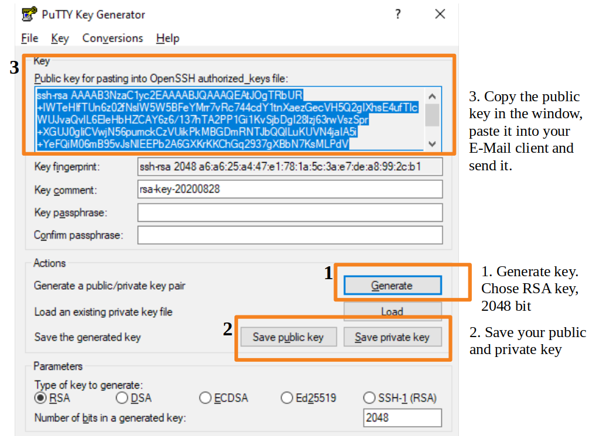
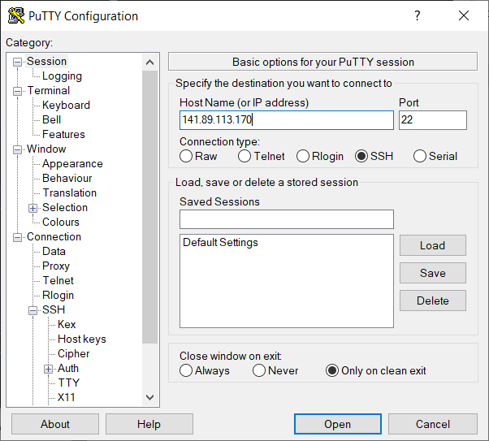
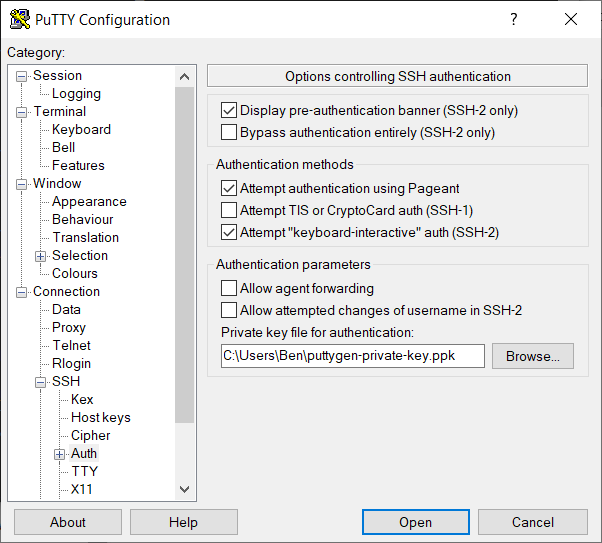
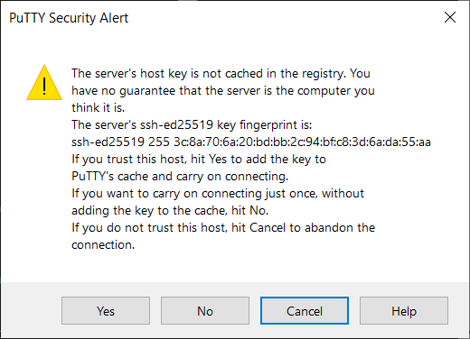
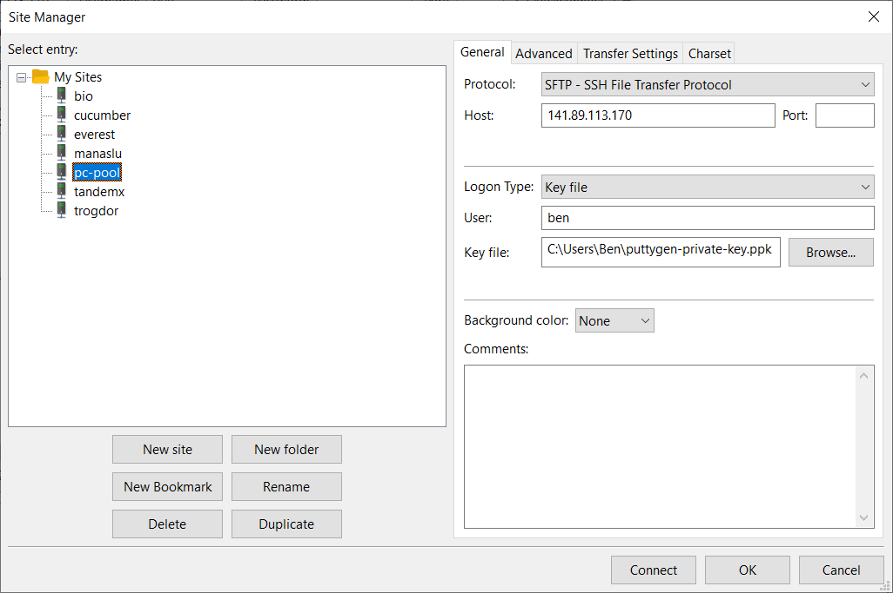
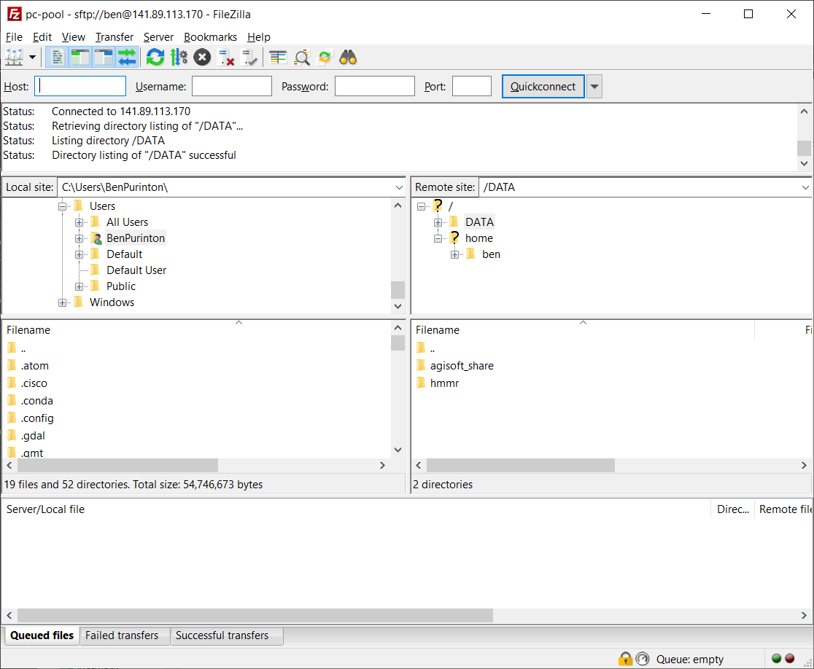
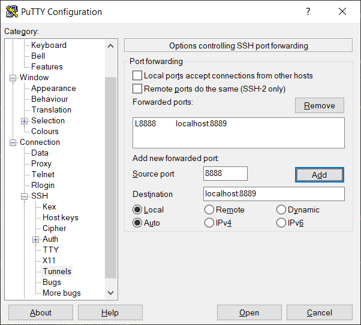

# Contact

If you have questions about this document you can find our team webpage with contact info at [https://up-rs-esp.uni-potsdam.de/](https://up-rs-esp.github.io/). Most questions can be addressed to Dr. Harald Schernthanner ([hschernt@uni-potsdam.de](mailto:hschernt@uni-potsdam.de)).

# Objectives

This document describes in detail how to access and work remotely using the PC Pool at Potsdam using `ssh` logins. You should already be familiar with your command line, setting up a Python environment, and Jupyter notebooks from the other manual titled _Geological Remote Sensing Python Setup_.

# Working Remotely: PC Pool in Golm (Building 27)

If you do not or cannot install the required software or Python environment on your personal computer, we have the option of working remotely through the PC Pool at Campus Golm. Heavy computation may also require the more powerful PC Pool on campus, so it's good to familiarize yourself with these steps and generate your own SSH private/public key pair for login to the PC Pool.


## Login Via `ssh`

[SSH](https://en.wikipedia.org/wiki/Secure_Shell) stands for secure shell and is a safe and encrypted way to access computers remotely. We will work with the `ssh` command-line environment. The below steps will walk you through ssh private/public key generation, allowing secure and easy login without passwords. Once logged into the remote PC Pool computer you will be in a Linux (Ubuntu 18.04.5) command-line environment.


### `ssh` Key Generation and Login: Windows

Windows does not come with `ssh` in the default command-line environment. The use of [PuTTY](https://www.putty.org/) is recommended. PuTTY is an ssh client, that has the capability to generate private/public ssh keys and login to remote servers. *As an alternative to the below steps, consider installing the [Windows Subsystem for Linux](https://docs.microsoft.com/en-us/windows/wsl/install-win10) available in Windows 10. This will give you a Linux terminal identical to Ubuntu (or whatever Linux flavor you prefer). In that case you could use the instructions in the next section for ssh login on Linux / Mac.*

1. Install [PuTTY](https://www.putty.org/) on your computer.

2. Open the program "PuTTYgen" (Open the start menu > search for "PuTTYgen" > click the icon), a key generator that is installed along with PuTTY.

3. Using PuTTYgen (see below figure): Generate a 2048 bit private/public key pair, save the public and private key to a secure location on your personal computer, and copy-paste the public key to send via email to the system administrator Harald Schernthanner ([hschernt@uni-potsdam.de](mailto:hschernt@uni-potsdam.de)). **Important: Keep your private key somewhere safe, consider adding a key passphrase in PuTTYgen, and _never_ handout your private key!**



4. Harald Schernthanner ([hschernt@uni-potsdam.de](mailto:hschernt@uni-potsdam.de)) generates an account for you after receiving your public key via email, puts your key on the system, contacts you when your account is ready, and tells you your username and the IP of your assigned machine.

5. When the account is ready, please login using PuTTY (Open the start menu > search for "PuTTY" > click the icon). You need to enter the *IP address of your assigned machine*:



6. To complete the login in PuTTY you have to tell the program the path to the private key (Connection > SSH > Auth), then you can press "Open" to login (and "Yes" to the security alert):





7. With login complete you will enter your username and end up on a command-line terminal for your assigned computer. Below we see user `ben` logged into `pcpool10`. You are now remotely logged into the PC Pool!


### `ssh` Key Generation and Login: Linux / Mac

On Linux or Mac, you should be able to use `ssh` right away from the terminal without installing any additional software.

1. Open a terminal and execute:
```
ssh-keygen
```

2. You will be asked to "Enter file in which to save the key (/home/ben/.ssh/id_rsa):". Here, define a folder and filename (e.g., `/home/yourusername/yourkeyname`). When you are asked to "Enter a passphrase:" leave it blank by pressing enter (we don't necessarily need a passphrase for the public key).

3. This generates two files: First the private key named `yourkeyname` (**keep it in a safe place and do not hand it out**) and second the public key named `yourkeyname.pub`. Send the public key to the administrator Harald Schernthanner ([hschernt@uni-potsdam.de](mailto:hschernt@uni-potsdam.de)).

4. Harald Schernthanner ([hschernt@uni-potsdam.de](mailto:hschernt@uni-potsdam.de)) generates an account for you after receiving your public key via email, puts your key on the system, contacts you when your account is ready, and tells you your username and the IP of your assigned machine.

5. Login with `ssh` from your terminal. You need to enter the *IP address of your assigned machine*. For username `ben` logging onto the assigned computer with IP address `141.89.113.170` (After the `-i` flag you have to define **the path to your private key**):
```
ssh -i /home/ben/yourkeyname ben@141.89.113.170
```


## Data Storage on PC Pool Computers

Do not store your data in your home directory (`/home/student`). Instead use `/DATA` for fast, local storage and `/NAS` for network storage. You should create your own sub-directory. For the user `ben`, I would write:
```
mkdir /DATA/ben
```

_**Note: We periodically wipe the `/home`, `/DATA`, and `/NAS` directories (don't worry, not during courses!), so don't plan on long-term storage on the PC Pool**_


## File Transfer Between Local and Remote Computers

At times you will need to move files between your local computer and the remote machines in the PC Pool. For instance, after you finish processing a large dataset on the remote computer you may want to transfer the output to your local system to look at the results and create figures. Or, for an `.ipynb` Jupyter notebook that you ran on the server, you may want to transfer it to your local computer after running. This is a common task and there are many options for file transfer between local and remote systems via SSH File Transfer Protocol ([SFTP](https://en.wikipedia.org/wiki/SSH_File_Transfer_Protocol)).

*Keep in mind: Likely, your download speed will be very fast (i.e., it will be fast to pull files from the PC Pool), but your upload speed will be slow (i.e., you have to be patient if you put data on the PC Pool).*


### GUI: FileZilla - *Your most likely choice*

You can install [FileZilla Client](https://filezilla-project.org/download.php?type=client) on any OS. This is a straight forward way to copy files back and forth (you see progress and expected up/download times). If you plan to move files back-and-forth continuously, you may want to look into `rsync` or a similar command-line option.

When you open FileZilla for the first time you will need to click the top left icon ("Open the Site Manager" with the little server icons underneath "File"). In the Site Manager window create a new site, call it "pc-pool", and fill out the "General" tab exactly as below (changing the fields to your host IP, username, and SSH private key file location):



After you click "Connect" you can see all of the files on the local and remote systems in two side-by-side panels, navigate around the system folders, and copy data back and forth:



**Note:** The new site "pc-pool" will stay in your site manager list and you can easily reconnect in your next FileZilla session as long as you don't move your SSH private key to a new location.


### Command Line: `rsync`

If you like to work on the command line (because it is more efficient), [rsync](https://en.wikipedia.org/wiki/Rsync) is the best option. It should come standard on Linux / Mac. For Windows: it is included in the [Cygwin](https://www.cygwin.com/) Linux-like terminal; can be added to the [Git](https://gitforwindows.org/) shell via [these instructions](http://tlundberg.com/blog/2020-06-15/installing-rsync-on-windows/); and/or is included in the [Windows Subsystem for Linux](https://docs.microsoft.com/en-us/windows/wsl/install-win10) available in Windows 10.

The basic syntax is:
```
rsync <options> <local filename> <remote filename>
```
For example, if I (user: `ben` on computer `141.89.113.160`) want to copy the file `my_jupyter_notebook.ipynb` from my local computer to the PC Pool location `/DATA/ben`, use:
```
rsync -avzh --progress my_jupyter_notebook.ipynb ben@141.89.113.160:/DATA/ben/
```
Or to transfer a remote file on the PC pool to my current directory (**Note:** the period (`.`) below refers to _**current directory**_, so wherever you are currently `cd`'d to):
```
rsync -avzh --progress ben@141.89.113.160:/DATA/ben/my_jupyter_notebook.ipynb .
```
The `rsync` options used here include: `-a` (archive), `-v` (verbose), `-z` (compress), `-h` (human readable), and `--progress` (progress bar). You can read about the `rsync` options online via the [manual](https://linux.die.net/man/1/rsync) or in [cheat sheets](https://devhints.io/rsync).


# Using Jupyter Remotely Via SSH

You can run Jupyter on the remote PCs to harness more computing power and to use datasets that you may not want (or be able) to download locally.

## Using `screen` Sessions

When logged in to the remote PC via the ssh command (Mac / Linux) or via PuTTY (Windows), you should _always_ start a `screen` session, which keeps your Jupyter notebook or other processes alive even if you lose your local internet connection. Simply enter the command:
```
screen
```
You can familiarize yourself with a few important `screen` commands [here](https://www.geeksforgeeks.org/screen-command-in-linux-with-examples/). The most important are:

To give the screen session a useful name for finding it later:
```
screen -S screen_name
```

To detach from a screen session without killing the screen (and thus killing the processing), use the keyboard shortcut:
`Ctrl-a + d`

And to re-join a detached screen:
```
screen -r screen_name
```

To end a screen, re-join it using the above command and just type `exit`. You can also end a screen without first rejoining it by entering:
```
screen -S screen_name -X quit
```

_**Note: You should become very familiar with the above screen commands. Especially detaching, re-joining, and quitting screens, which you should be doing in every SSH session! If you keep starting new screens without ending old ones we eventually have to kill all the processes**_


## Opening Remote Notebook Via Port Forwarding: Linux / Mac

On Mac / Linux login to the remote PC using ssh:
```
ssh -i /home/my_username/yourkeyname my_username@my_pc_ip_address
```

Once you are in a **screen session** on the remote PC, we can setup the Jupyter notebook via port forwarding. First do:
```
conda activate <Class Environment Name>
jupyter notebook --generate-config
jupyter notebook password
```

This will first activate the Python environment for the class (e.g., `DataAnalysis` in place of `<Class Environment Name>`), then generate a configuration file for Jupyter, and then allow you to create a password to access the notebook.

Following this, you need to `cd` into the remote directory where your data is stored, e.g., `cd /DATA/my_username/DataAnalysis_Labs/`. Make sure that you have your own directory set up on the `/DATA` drive! Otherwise you will overwrite each other's work!

Now start the Jupyter Notebook session on the PC Pool:
```
jupyter notebook --no-browser --port=XXXX
```

Replace "XXXX" with your assigned port number. _**Note: Use the four-digit port number (e.g., 8888) that was assigned to you along with your PC IP address and username. If you accidentally use the same port as someone else on the same PC, you would be trying to edit each other's notebooks!**_

Now you are all set on the server side and you can open a new command line / terminal on your local computer.

The next step is to tell your local computer how to access the remotely running Jupyter Notebook you started on the server. We do this via port forwarding. Once again, this is a simple one-line command **run in a new command-line prompt on your local computer**:

```
ssh -N -f -L localhost:YYYY:localhost:XXXX -i /home/my_username/yourkeyname my_username@my_pc_ip_address
```

`-N` tells SSH that no remote commands will be executed, `-f` tells SSH to go to background so the local terminal remains usable, and `-L` lists the port forwarding configuration (remote port XXXX to local port YYYY). Here, "XXXX" is the same port you used in the remote PC command above, and "YYYY" is the port you want your local computer to listen on. You can use the default 8888 in place of "YYYY", or whatever port you prefer. This command won't show any output – you can check it is working by opening up your web browser, and navigating to the url "http://localhost:YYYY/".

You should now be able to access the remote notebooks directly from your browser, while using the computing power of the PC Pool. File transfers between the local and remote machines for datasets, notebooks, and outputs from running scripts can be accomplished using FileZilla or `rsync`, as described above.


## Opening Remote Notebook Via Port Forwarding: Windows

On Windows first open PuTTY and enter the IP address of your assigned machine (**Note:** You can save the IP address by entering it in the "Saved Sessions" box and then pressing "Save" so you don't have to keep entering it when you open PuTTY).

After this, navigate to Connection > SSH > Tunnels and put in "Source port" the local port that you want to listen on. You can use 8888 here, or any other port greater than 8000 (e.g., 8881). In the "Destination" put "localhost:XXXX" and then press "Add". Replace "XXXX" with your assigned port number. _**Note: Use the four-digit port number (e.g., 8888) that was assigned to you along with your PC IP address and username. If you accidentally use the same port as someone else on the same PC, you would be trying to edit each other's notebooks!**_

In this example the user `ben` has been assigned port 8889:



Now you can press "Open" to start the remote session with port forwarding setup. Your computer will "listen" on port 8888 and the remote PC will broadcast on port 8889, or whatever port combination you use.

In the remote terminal start a **screen session**. Once you are in a screen on the remote PC, we can setup the Jupyter notebook. First do:
```
conda activate <Class Environment Name>
jupyter notebook --generate-config
jupyter notebook password
```

This will first activate the Python environment for the class (e.g., `DataAnalysis` in place of `<Class Environment Name>`), then generate a configuration file for Jupyter, and then allow you to create a password to access the notebook.

Following this, you need to `cd` into the remote directory where your data is stored, e.g., `cd /DATA/my_username/DataAnalysis_Labs/`. Make sure that you have your own directory set up on the `/DATA` drive! Otherwise you will overwrite each other's work!

Now start the Jupyter Notebook session on the PC Pool:
```
jupyter notebook --no-browser --port=XXXX
```

Replacing "XXXX" with your assigned port number.

Now on you local computer open a browser and navigate to the url "http://localhost:8888/", replacing 8888 with whichever port you put in the "Source port" in PuTTY.

You should now be able to access the remote notebooks directly from your browser, while using the computing power of the PC Pool. File transfers between the local and remote machines for datasets, notebooks, and outputs from running scripts can be accomplished using FileZilla or `rsync`, as described above.
